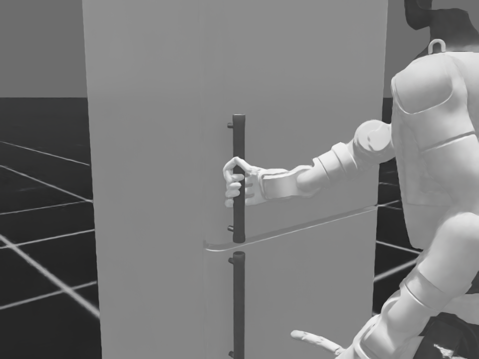
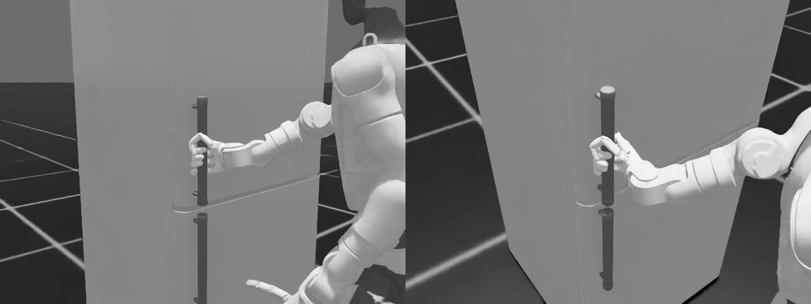

# 冰箱把手静态整手握持：数学模型与 Isaac 验证

## 结论

本轮不再以指尖到单点的距离作为“抓住”判据，而是从 Isaac 场景导出冰箱上门把手的真实三角网格，并用 G1 Wuji 整只右手的 STL 表面求解一个固定 power grasp。最终姿态通过全分辨率网格复核，并在 Isaac Sim RTX 中从正面、反面和俯视三个固定相机渲染。





## 先前错误的根因

1. `E_handle_1_7` 父 Xform 的整体包围盒为约 49.8 × 26.4 mm，其中包含竖杆和上下安装支架。它的中心 x≈1.2850 m，不是手实际握住的竖杆轴线。
2. 对真实三角网格在 z=0.875 m 处做平面求交后，竖杆中心为 `(1.27316, 0.27162)` m，半径约 12.06 mm。此前使用父 Xform 中心使手在 x 方向偏了约 11.85 mm。
3. 第一版测试只要求“每根手指合并后的网格至少有一处接触”。这允许手指近端偶然碰到竖杆、其余指节仍然张开，因此数值 pass 但图片明显不是握持。

## 数学模型

把手中部建模为从真实网格测得的竖直圆柱。对掌心坐标系中的任意手部表面点 `p`，把手轴心 `c`、单位轴向 `a`、半径 `r=0.01206 m`，径向有符号距离为：

```text
d(p) = ||(I - a a^T)(p - c)|| - r
```

- `d > 0`：手和把手之间有间隙；
- `d = 0`：表面接触；
- `d < 0`：发生穿模。

优化变量共 19 个：把手轴心在掌心系中的 3D 位置、拇指 4 个关节角、四指各自的 MCP/PIP/DIP 三个屈曲角。四指侧摆关节固定为 0，避免靠横向扭指制造假接触。

约束和目标包括：

- 拇指近/中段及四指近端指腹必须接触；
- 四指中段必须保持弯曲并位于把手表面 7 mm 内；
- 不使用指尖作为目标；
- 掌面与把手间隙不超过 6 mm；
- 任意掌/指网格穿入不超过 1 mm；
- 接触方向在把手横截面上的包覆角不低于 190°；
- 关节限位及自然屈曲正则项。

先用降采样表面进行 differential evolution，再用全部 STL 顶点、边中点和三角面心复核。全身阶段保持双脚和躯干稳定，仅用逆运动学把已求得的掌心相对位姿映射到机器人。

## 最终严格验收

最终全身 IK 后重新计算，而不是直接复用手部优化阶段的指标：

| 指标 | 最终值 | 阈值 |
|---|---:|---:|
| 掌心目标映射误差 | 0.105 mm | ≤ 0.5 mm |
| 横截面包覆角 | 226.17° | ≥ 190° |
| 掌面间隙 | 5.15 mm | ≤ 6 mm |
| 拇指近/中段最大接触间隙 | 0.128 mm | ≤ 2 mm |
| 四指近端指腹最大接触间隙 | 0.732 mm | ≤ 2 mm |
| 四指中段最大表面距离 | 6.59 mm | ≤ 7 mm |
| 全部掌/指网格最大穿入 | 0.158 mm | ≤ 1 mm |

全身姿态同时保持接近直立：腰 yaw/roll/pitch 分别为 3.25°/-0.95°/-1.20°，左右膝为 18.78°/13.06°。这些量记录在 `outputs/static_power_grasp_final_validation.json`。

## 文件与复现

- `scripts/export_handle_mesh.py`：从 Isaac USD 导出真实把手网格；
- `outputs/upper_handle_mesh.npz`：把手顶点和三角面；
- `scripts/optimize_static_power_grasp_geometry.py`：静态整手几何优化；
- `outputs/static_power_grasp_geometry_solution.json`：优化变量、逐指节距离和验收结果；
- `scripts/solve_static_power_grasp.py`：将静态手型和掌心相对位姿映射到全身；
- `scripts/validate_static_power_grasp_geometry.py`：最终全分辨率复核；
- `outputs/static_power_grasp_final_validation.json`：最终测试报告；
- `outputs/isaac_static_power_grasp.npz`：Isaac 关节姿态；
- `outputs/g1_fridge_static_power_grasp_front.png`、`_opposite.png`、`_top.png`、`_two_views.png`：RTX 渲染结果。

本地求解和验证：

```bash
python3 scripts/optimize_static_power_grasp_geometry.py
python3 scripts/solve_static_power_grasp.py
python3 scripts/validate_static_power_grasp_geometry.py
```

Isaac 仅借用服务器现有的 Isaac Sim 5.1 / Isaac Lab 2.3 Python 运行环境；本轮抓握姿态、先验、网格和测试均来自当前 CoorDex 项目的 G1 Wuji 与冰箱资产，没有从 Doorman 项目查找或复制抓握数据。

## 范围

当前文档描述门角 0° 下的静态整手握持。该固定手型已经在 `RESULT_WHOLEBODY_POWER_GRASP.md` 中传播到完整 0–60° 全身闭链轨迹，并通过 241 帧几何、稳定性与连续性测试。摩擦、法向力、门阻力矩和可承受拉力仍属于后续动力学验证范围。
