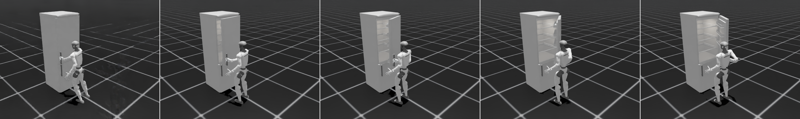
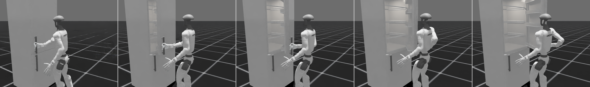
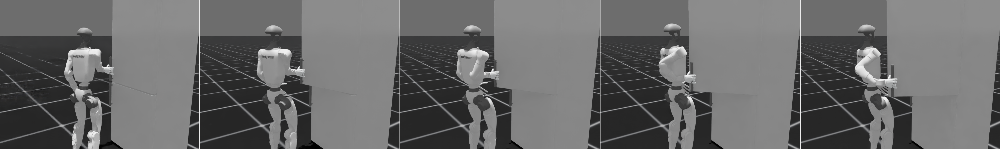

# 全身协同开冰箱：数学模型、严格测试与 Isaac 结果

## 结论

旧版本虽然通过接触测试，却把躯干朝向几乎锁死：0° 到 60° 的胸廓 yaw 只变化约 0.2°，末帧右肩 yaw 被迫达到 145.2°，腕 pitch 同时贴到 -45° 边界。那是“手仍在把手上、手臂已经畸形”的错误逆解分支。

新版把圆柱把手的轴向冗余、骨盆移动、胸廓转身、肩肘腕形态和跨帧连续性放入同一模型。60° 轨迹在 241 个稠密帧上通过 36/36 项测试；15°、30°、45°、60° 四种终止角也分别独立重求解并全部通过。







## 1. 闭链与整手抓持

记 Isaac 门体位姿为 `T_d(θ)`，真实把手轴心为 `h₀`，则：

```text
ΔT_d(θ) = T_d(θ) T_d(0)^-1
h(θ)    = ΔT_d(θ) h₀
```

静态网格优化得到的右手 20 个关节角 `q_hand*` 在全部帧保持不变。把手在掌坐标系中的位置 `p_h` 也保持不变。掌目标为：

```text
R_p*(θ,γ) = R_z(γ) ΔR_d(θ) R_p(0)
p_p*(θ,γ) = h(θ) - R_p*(θ,γ) p_h
```

`γ` 是手绕竖直圆柱轴的精确几何零空间，不改变掌面、指节与圆柱的相对接触。旧版固定使用 `γ(60°)=+40°`，导致肩腕进入奇异分支；新版先最小化名义全身姿态与目标掌姿态的 SO(3) 距离，再加入平滑关节余量偏置，避开 45°–55° 的肘腕奇异区。

## 2. 全身协同变量与目标

每个门角求解：

```text
x(θ) = [p_root, rpy_root, q_body]
```

其中包含浮动骨盆 6D、双腿、腰、双臂和右臂 7 自由度。名义轨迹 `x̄(θ)` 来自当前 CoorDex 内已有的直立全身参考，并在 0° 与已验收静态抓握精确对齐。15° 后骨盆 heading 用 C2 minimum-jerk 逐渐转入，60° 时额外转入 10°；腿和腰再通过 IK 分担该转向。

加权最小二乘目标为：

```text
min_x  ||W_p (p_p(x)-p_p*)||²
     + ||W_R Log(R_p*ᵀ R_p(x))||²
     + Σfeet ||W_f Log(T_f*⁻¹ T_f(x))||²
     + ||W_t Log(T_torso*⁻¹ T_torso(x))||²
     + ||W_c (CoM_xy-c_support)||²
     + ||W_n (x-x̄)||²
     + ||W_Δ (x-x_previous)||²
```

并施加关节硬边界：肩 yaw `[-80°,80°]`、肩 roll `[-60°,70°]`、腕 roll `[-45°,45°]`、腕 pitch `[-40°,20°]`、腕 yaw `[-75°,75°]` 等。它们不是最终验收的替代品；验收器还独立计算肩—肘—腕几何与跨帧变化。

## 3. 移动与任意终止角

求解器支持：

```bash
python3 scripts/solve_wholebody_power_grasp_trajectory.py \
  --max-door-angle 45 \
  --angle-step 0.5 \
  --output outputs/isaac_wholebody_power_grasp_45deg.npz
```

当前实测门体参考覆盖 0°–60°，因此 `--max-door-angle` 可取该区间内任意正值。移动支撑轨迹和根部位移被显式导出，不再把机器人锁在 0° 世界位置；60° 轨迹最大足部路径位移为 75.7 mm，最大相邻根部位移为 9.93 mm。

这里的“移动”仍是准静态 kinematic support path，不是带接触切换、摆动脚离地和落脚冲击的动态行走 policy。若需要真正迈步，还必须增加单/双支撑状态机、足底摩擦锥、ZMP/CMP 或 centroidal dynamics 以及接触力测试。

## 4. 分支连续投影

逐帧 IK 即使单帧残差很小，也可能切到另一肩部解。新版先检查根部和身体关节增量；若超过阈值，则在跳变邻域建立 C2 配置空间曲线，再用根部 SE(3) 小修正投影回精确掌约束。最终 48°–55° 区间完成一次该投影：

- 最大相邻身体关节变化：5.92°，阈值 7°；
- 最大相邻根部位移：9.93 mm，阈值 12 mm；
- 稠密帧掌位置误差：0.453 mm；
- 稠密帧掌方向误差：0.140°。

## 5. 241 帧、36 项严格测试

| 类别 | 观测最坏值 | 阈值 |
|---|---:|---:|
| 掌位置 / 方向误差 | 0.453 mm / 0.140° | ≤ 1 mm / 1° |
| 足部位置 / 方向误差 | 0.983 mm / 0.077° | ≤ 2 mm / 0.3° |
| 最小支撑裕度 | 17.95 mm | ≥ 10 mm |
| 掌面间隙 / 必接触指节间隙 | 5.271 / 0.791 mm | ≤ 6 / 2 mm |
| 中段近接触间隙 / 最大穿入 | 6.628 / 0.268 mm | ≤ 7 / 1 mm |
| 最小包覆角 | 225.03° | ≥ 190° |
| 胸廓最终转身 | 14.76° | ≥ 10.8°（随终止角缩放） |
| 肩 pitch / roll / yaw 最大绝对值 | 70.77° / 46.93° / 30.53° | ≤ 90° / 60° / 70° |
| 肘部几何夹角 | 78.66°–169.67° | 70°–175° |
| 肩到掌距离 | 0.236–0.383 m | 0.20–0.42 m |
| 膝角范围 | 12.04°–23.60° | 5°–30° |
| 身体最大速度 / 加速度 | 1.493 rad/s / 31.19 rad/s² | ≤ 4 / 35 |
| 相邻关节 / 根部变化 | 5.92° / 9.93 mm | ≤ 7° / 12 mm |
| 关节限位越界 | 0 | 0 |

多角度测试矩阵：

| 终止角 | 测试结果 | 实际胸廓转身 |
|---:|---:|---:|
| 15° | 36/36 PASS | 2.94° |
| 30° | 36/36 PASS | 5.55° |
| 45° | 36/36 PASS | 12.00° |
| 60° | 36/36 PASS | 14.76° |

逐帧原始结果见 `outputs/wholebody_power_grasp_strict_validation.json` 和三个 `wholebody_power_grasp_validation_*deg.json`。

## 6. Isaac 复核与文件

- `outputs/g1_fridge_wholebody_coordinated_full_keyframes.png` / `_full_10s.mp4`：全身；
- `outputs/g1_fridge_wholebody_coordinated_hand_keyframes.png` / `_hand_10s.mp4`：正侧；
- `outputs/g1_fridge_wholebody_coordinated_opposite_keyframes.png` / `_opposite_10s.mp4`：反侧；
- `outputs/g1_fridge_wholebody_coordinated_final_opposite.png`：60° 反侧末帧；
- `outputs/isaac_wholebody_power_grasp_action.npz`：60°、121 关键帧主轨迹；
- `scripts/solve_wholebody_power_grasp_trajectory.py`：参数化协同求解器；
- `scripts/validate_wholebody_power_grasp_trajectory.py`：36 项稠密测试。

Isaac 只借用了服务器现有 Isaac Sim 5.1 / Isaac Lab 2.3 运行时；动作、手型、网格、全身参考和测试均来自当前 CoorDex 项目，没有从 Doorman 项目提取动作数据。

## 7. 未覆盖的动力学边界

当前通过的是几何闭链、运动学支撑、全手网格接触、人体化关节形态和时序连续性。尚未验证门阻力矩、执行器力矩余量、真实摩擦、接触力、足底滑移和动态落脚，因此不能据此宣称真实 G1 已能可靠完成该动作。
